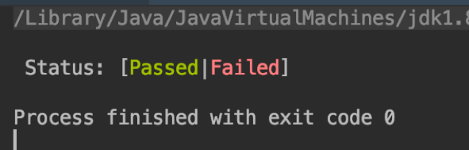

[](https://mvnrepository.com/artifact/io.github.dgroup/term4j)
[](http://www.javadoc.io/doc/io.github.dgroup/term4j)
[](./license.txt)
[](https://github.com/dgroup/term4j/graphs/commit-activity)

[](https://travis-ci.org/dgroup/term4j)
[](http://www.0pdd.com/p?name=dgroup/term4j)
[](https://requires.io/github/dgroup/term4j/requirements/?branch=master)
[](https://snyk.io/org/dgroup/project/58b731a9-6b07-4ccf-9044-ad305ad243e6/?tab=dependencies&vulns=vulnerable)

[](http://www.rultor.com/p/dgroup/term4j)
[](http://www.elegantobjects.org/#principles)
[](https://www.jetbrains.com/idea/)

[](http://www.qulice.com/)
[](https://sonarcloud.io/dashboard?id=io.github.dgroup%3Aterm4j)
[](https://codebeat.co/projects/github-com-dgroup-term4j-master)
[](https://www.codacy.com/app/dgroup/term4j?utm_source=github.com&amp;utm_medium=referral&amp;utm_content=dgroup/term4j&amp;utm_campaign=Badge_Grade)
[](https://codecov.io/gh/dgroup/term4j)

## What it is
**term4j** is an object-oriented primitives to simplify the manipulations with CLI terminal(s) for Java-based applications.

## Principles
[Design principles](http://www.elegantobjects.org#principles) behind term4j.

## How to use
Get the latest version [here](https://github.com/dgroup/term4j/releases):

```xml
<dependency>
    <groupId>io.github.dgroup</groupId>
    <artifactId>term4j</artifactId>
    <version>${version}</version>
</dependency>
```

Java version required: 1.8+.

Interface                   | Purpose                                                               | Implementations / Related
----------------------------|-----------------------------------------------------------------------|-------------------------------------------------
[Arg\<T>](#argt)            | Allows to fetch the application arguments                             | [StringOf](#stringof--textof), [NumberOf](#numberof), [PathOf](), [FileOf](), [EnvOf](#envof), [PropOf](#propof), [Alt](#alt), [Unchecked](), [etc](src/main/java/io/github/dgroup/term4j/arg/) |
[Std](#std)                 | Wrap the raw manipulation with `std out`                              | [StdOf](#stdof), [Inmem](), [etc](src/main/java/io/github/dgroup/term4j/std)
[Highlighted](#highlighted) | The colored extension of [Text](https://goo.gl/2ZYC83) for `std out`  | [Green](src/main/java/io/github/dgroup/term4j/highlighted/Green.java), [Red](src/main/java/io/github/dgroup/term4j/highlighted/Red.java), [Yellow](src/main/java/io/github/dgroup/term4j/highlighted/Yellow.java), [etc](src/main/java/io/github/dgroup/term4j/highlighted)
[Runtime](#runtimeof)       | Wrap the raw manipulation with JVM runtime                            | [RuntimeOf](src/main/java/io/github/dgroup/term4j/runtime/RuntimeOf.java), [FakeRuntime](src/main/java/io/github/dgroup/term4j/runtime/FakeRuntime.java), [AppException](src/main/java/io/github/dgroup/term4j/runtime/AppException.java), [etc](src/main/java/io/github/dgroup/term4j/runtime)

All examples below are using the following frameworks/libs:
 - [Hamcrest](https://github.com/hamcrest/JavaHamcrest) - Library of matchers, which can be combined in to create flexible expressions of intent in tests.
 - [cactoos](https://github.com/yegor256/cactoos) - Object-Oriented Java primitives, as an alternative to Google Guava and Apache Commons.
 - [cactoos-matchers](https://github.com/yegor256/cactoos) - Object-Oriented Hamcrest matchers

### [Arg\<T>](src/main/java/io/github/dgroup/term4j/Arg.java)
#### [StringOf](src/main/java/io/github/dgroup/term4j/arg/StringOf.java) / [TextOf](src/main/java/io/github/dgroup/term4j/arg/TextOf.java)
Fetch the string/[Text](https://goo.gl/2ZYC83) argument:
```bash
$ java -jar app.jar --key vOIkv7mzQV2UkV1
```
```java
public static void main(String[] cargs) {
    final List<String> args = new ListOf<>(cargs);
    MatcherAssert.assertThat(
        "The argument '--key' has value 'vOIkv7mzQV2UkV1'",
        new StringOf("--key", args),
        new ArgHas<>("vOIkv7mzQV2UkV1")
    );
    // or
    final Arg<String> key = new StringOf("--key", args);
}
```
#### [NumberOf](src/main/java/io/github/dgroup/term4j/arg/NumberOf.java)
Fetch the numeric argument:
```bash
$ java -jar app.jar -t 10
```
```java
public static void main(String[] cargs) throws ArgNotFoundException {
    final List<String> args = new ListOf<>(cargs);
    MatcherAssert.assertThat(
        "The argument '-t' has value '10'",
        new NumberOf("-t", args).toInt(),
        new IsEqual<>(10)
    );
    // or
    final int threads = new NumberOf("-t", args).toInt();
}
```
#### [PathOf](src/main/java/io/github/dgroup/term4j/arg/PathOf.java) / [FileOf](src/main/java/io/github/dgroup/term4j/arg/FileOf.java)
Fetch the argument as a `java.nio.file.Path` or `java.io.File`:
```bash
$ java -jar app.jar -f ./readme.md
```
```java
public static void main(String[] cargs) throws ArgNotFoundException {
    final List<String> args = new ListOf<>(cargs);
    MatcherAssert.assertThat(
        "The argument '-f' has path './readme.md'",
        new PathOf("-f", args),
        new ArgHas<>(Paths.get(".", "readme.md"))
    );
    // or
    final Arg<Path> src = new PathOf("-f", args);
}
```
#### [EnvOf](src/main/java/io/github/dgroup/term4j/arg/EnvOf.java)
Fetch the environment variable:
```bash
$ echo $JAVA_HOME
/Library/Java/JavaVirtualMachines/jdk1.8.0_181.jdk/Contents/Home
```
```java
public static void main(String[] cargs) throws ArgNotFoundException {
    final List<String> args = new ListOf<>(cargs);
    MatcherAssert.assertThat(
        "The environment variable 'JAVA_HOME' has 1.8.0_181",
        new EnvOf("JAVA_HOME").value(),
        new StringContains("1.8.0_181")
    );
    // or
    final Arg<String> jhome = new EnvOf("JAVA_HOME");
}
```
#### [PropOf](src/main/java/io/github/dgroup/term4j/arg/PropOf.java)
Fetch the application property:
```bash
$ java -Dlevel=debug -jar app.jar
```
```java
public static void main(String[] cargs) throws ArgNotFoundException {
    final List<String> args = new ListOf<>(cargs);
    MatcherAssert.assertThat(
        "The application property 'level' is 'debug'",
        new PropOf("level"),
        new ArgHas<>("debug")
    );
    // or
    final Arg<String> verbose = new PropOf("level");
}
```
#### [Alt](src/main/java/io/github/dgroup/term4j/arg/Alt.java)
The alternative value in case if the argument wasn't specified:
```bash
$ java -jar app.jar
```
```java
public static void main(String[] cargs) {
    final List<String> args = new ListOf<>(cargs);
    MatcherAssert.assertThat(
        "The argument '--key' is using default value 'vOIkv7mzQV2UkV1'",
        new Alt(
            new StringOf("--key", args),
            "vOIkv7mzQV2UkV1"
        ),
        new ArgHas<>("vOIkv7mzQV2UkV1")
    );
    // or
    final Arg<String> key = new Alt(
        new StringOf("--key", args), "vOIkv7mzQV2UkV1"
    );
}
```
### [Std](src/main/java/io/github/dgroup/term4j/Std.java)
#### [StdOf](src/main/java/io/github/dgroup/term4j/std/StdOf.java)
Wrap the std out, for example for unit testing purposes:
```java
    /**
     * Simulate the STD print procedure using {@link StringWriter}.
     */
    @Test
    public void printToWriter() {
        // Write 4 lines delimited by `\n` or `\r\n` to the StringWriter
        final StringWriter swter = new StringWriter();
        final Std std = new StdOf(swter);
        std.print("line1", "line2");
        std.print("line3", "line4");
        // Check that the result string has 4 lines
        MatcherAssert.assertThat(
            "4 lines of text were printed to the output",
            swter.toString(),
            new HasLines("line1", "line2", "line3", "line4")
        );
    }
```
### [Highlighted](src/main/java/io/github/dgroup/term4j/Highlighted.java)
### [Green](src/main/java/io/github/dgroup/term4j/highlighted/Green.java) / [Red](src/main/java/io/github/dgroup/term4j/highlighted/Red.java)
Print colored text to the `std out`:
```java
public static void main(String[] cargs) {
    System.out.printf(
        "%n Status: [%s|%s] %n", new Green("Passed"), new Red("Failed")
    );
}
```


See [more](src/main/java/io/github/dgroup/term4j/highlighted/).
### RuntimeOf
Exit from application using particular exit code:
```java
public static void main(String[] cargs) {
    try {
        // application exception happens
    } catch (final AppException cause) {
        new RuntimeOf().shutdownWith(
            cause.exitCode()
        );
    }
}
```